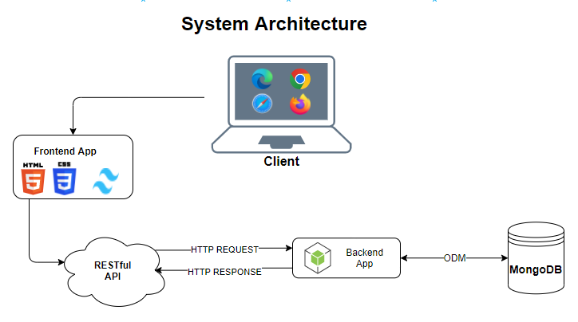

# INSE6250 Quality Methodologies In Software Engineering

## Project Title : Developing a Contact Management System with Ensured Quality Attributes

### System Architecture Description for a Contact Management App

### Overview

The contact management app is designed to allow users to store, retrieve, and manage their contacts. It follows a **REST API architecture**, with **Express.js** as the backend framework, **MongoDB** as the database, and basic **HTML** and **CSS** utility class framework **_Tailwindcss_** is for the frontend.

### Components

1.  **Frontend (HTML/CSS) & JavaScript:**

    -   The frontend provides a mobile-friendly interface for clients to interact with the app, leveraging HTML, CSS utility class framework Tailwindcss and JavaScript.
    -   The frontend app has well advertised signup page for user onboarding.
    -   On login, there is intuitive user interface to navigate and manage contacts, such as view contact lists, allow users to add, edit or delete contacts.
    -   HTML forms are used to capture user input for creating and updating contact information.
    -   HTML form fields are validated in real time to ensure data integritiy before making API requests.

        -   Some of the validation fields are:

        | Field                  | Validation                                       |
        | ---------------------- | ------------------------------------------------ |
        | First name             | `isString()`                                     |
        | Last name              | `isString()`                                     |
        | Company                | `isString().optional()`                          |
        | Phone                  | `/^\+\d{1,4} \(\d{1,4}\) \d{3}\-\d{4}$/.test()`  |
        | Email                  | `"/^[^\s@]+@[^\s@]+\.[^\s@]+$/".test(input)`     |
        | Website                | `"/^(https?:\/\/).+$/".test(input)`              |
        | Address – Unit number  | `isNumber().optional()`                          |
        | Address – Civic number | `isNumber().optional()`                          |
        | Address – Street       | `isString().optional()`                          |
        | Address – City         | `isString().optional()`                          |
        | Address – Province     | `isString().isOptional.isLength({min:2, max:2})` |
        | Address – Postal code  | `"/^[A-Z]\d[A-Z] \d[A-Z]\d$/".test(input)`       |

        -   Asynchronous JavaScript Fetch API communicates with the backend via the REST API to perform CRUD operations and update the UI accordingly without needing to refresh the page.

2.  **Backend (Express.js):**

    -   The backend handles HTTP requests and responses.
    -   It exposes RESTful endpoints for CRUD operations on users and contacts.
    -   Backend implements also same logic as frontend to sanitize data before storing into database.
    -   Express.js middleware handles authentication, validation, and error handling.
    -   Routes are defined for endpoints like `/contacts`, `/contacts/:id` and, `/users`, `/user/:id`.

3.  **Database (MongoDB):**

    -   MongoDB is used as the NoSQL database to store and manage contact data due to its flexibility and scalability.
    -   Collections:
        -   A `users` collection stores individual user information records
            -   Each contact document contains fields like `name`, `email`, `password`.
        -   A `contacts` collection stores individual contact records.
            -   Each contact document contains fields like `firstName`,`lastName`, `email`, `phone`, `company`, `website`, `address: (unit number, civic number, city, province,postalCode)`.
    -   Mongo Db Schemas also have validators incase of any validation fails in the backend data.

4.  **REST API Endpoints:**

    #### Users API

    -   `/users/signup` (POST): Creates a new user.
    -   `/users/login`(POST): login user.
    -   `/users/:id` (PATCH): Updates an existing user.
    -   `/users/:id` (DELETE): Deletes a user.
    -   `/user` (GET): Retrieves a list of all contacts.

    #### Contacts API

    -   `/contacts` (GET): Retrieves a list of all contacts.
    -   `/contacts/:id` (GET): Retrieves a specific contact by ID.
    -   `/contacts` (POST): Creates a new contact.
    -   `/contacts/:id` (PUT): Updates an existing contact.
    -   `/contacts/:id` (DELETE): Deletes a contact.

5.  **Business Logic:**

    -   The backend processes requests, validates input, and interacts with the database.
    -   When a user adds or edits a contact, the backend validates the data and performs the necessary operations (e.g., inserting or updating records in MongoDB).

6.  **Authentication and Authorization:**

-   Users must Signup with unique email id and must have a password to use the app to manage contacts.
-   Basic authentication or token-based authentication is implemented for user authentication.
-   Authorization middleware ensures that only authorized users can access certain endpoints (e.g., editing or deleting contacts).
