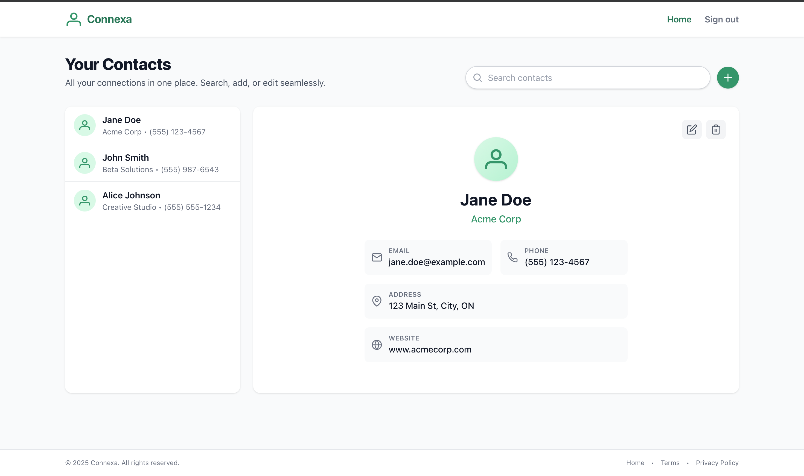
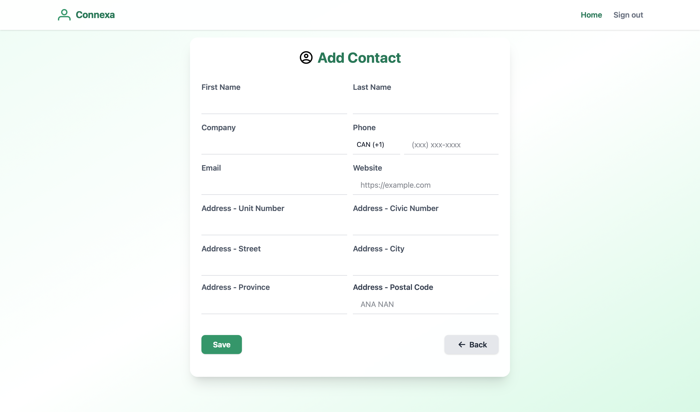
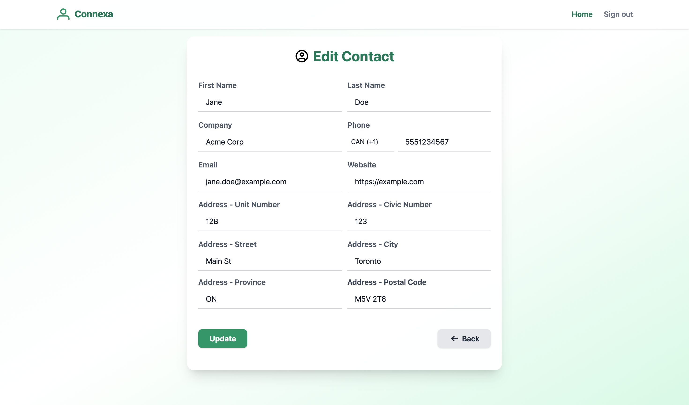
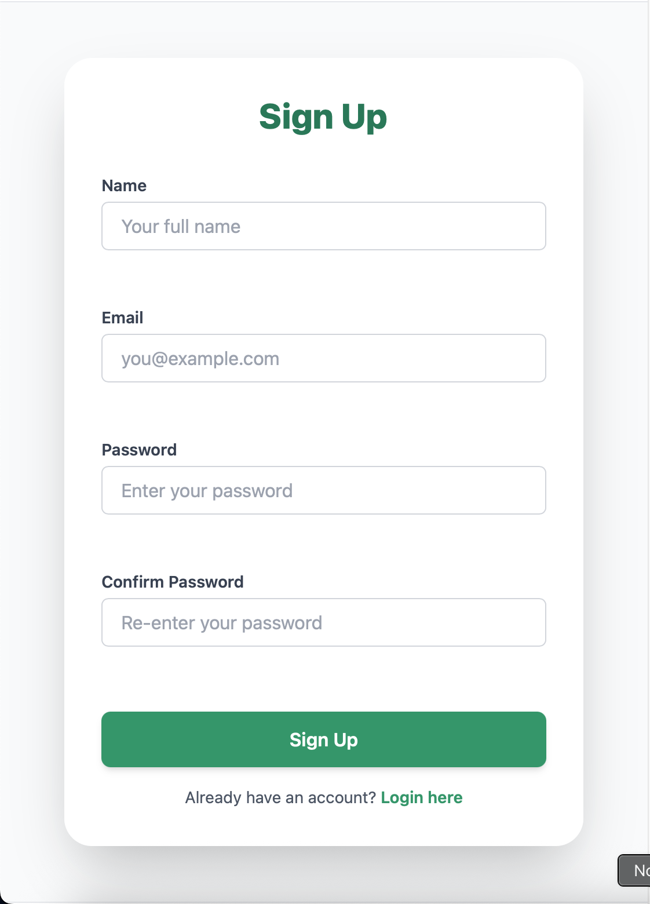
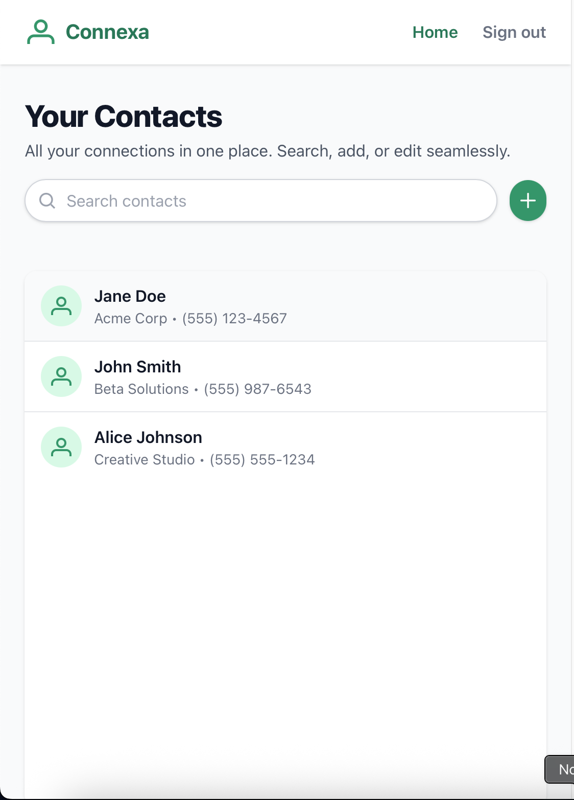

# CONNEXA - A cloud based Contact Management System

This is the frontend/interfcace for Connexa, which is a web application designed to store, view, edit, and delete contact information securely and efficiently. The project utilizes HTML, CSS (with Tailwind CSS for styling), and JavaScript to provide a user-friendly interface and a seamless experience.

## Screenshots

### Landing Page


### Signup Page


### Login Page


### Dashboard



### Add Contact



### Edit Contact



### Mobile Screenshots


<div style="display: flex; gap: 10px; flex-wrap: wrap;">
  
   

   
   
   
   
   

</div>


## Features

- **User Authentication**: Secure login system to access contact management features.
- **Contact CRUD Operations**: Create, Read, Update, and Delete contacts.
- **Responsive Design**: The application is fully responsive and works well on various devices and screen sizes.
- **Search Functionality**: Easily search for contacts within the system.

## Project Structure

```
src
├─ assets
│  ├─ css
│  │  └─ reset.css
│  ├─ img
│  │  ├─ coffeeNdrinks.jpg
│  │  ├─ coffeeNfriends.jpeg
│  │  ├─ notebook_icon.png
│  │  └─ person-account-circle-svgrepo-com.svg
│  ├─ js
│  │  ├─ contact.js
│  │  ├─ login.js
│  │  ├─ navigation.js
│  │  ├─ signup.js
│  │  └─ validation.js
│  └─ tailwind
│     ├─ input.css
│     └─ output.css
├─ auth
│  ├─ login.html
│  └─ signup.html
├─ contact
│  ├─ contact-form.html
│  └─ contact.html
└─ index.html
```

## Getting Started

### Prerequisites

- A modern web browser supporting HTML5, CSS3, and JavaScript.

### Installation

1. Clone the repository to your local machine:
   ```bash
   git clone https://github.com/Iktisad/connexa.git
   ```
2. Navigate to the project directory

   ```bash
    cd connexa
    cd frontend
   ```

3. install the following dependencies

   ```bash
   npm i
   ```

4. Build tailwind config with the following command
   ```bash
   npx tailwindcss -i ./src/assets/tailwind/input.css -o ./src/assets/tailwind/output.css
   ```

### Usage

1. Login/Signup: Access the system using your credentials or sign up if you're a new user.
2. View Contacts: Navigate to the Contacts page to see a list of all stored contacts.
3. Add New Contact: Use the "Add Contact" button to store new contact information.
4. Edit/Delete Contact: Each contact card has options to edit or delete the contact.
5. Contributing

### Contributing

Contributions to enhance the Contact Management System are welcomed. Please feel free to fork the repository, make changes, and submit pull requests.

### License

This project is open-sourced under the MIT License. See the LICENSE file for more details.
